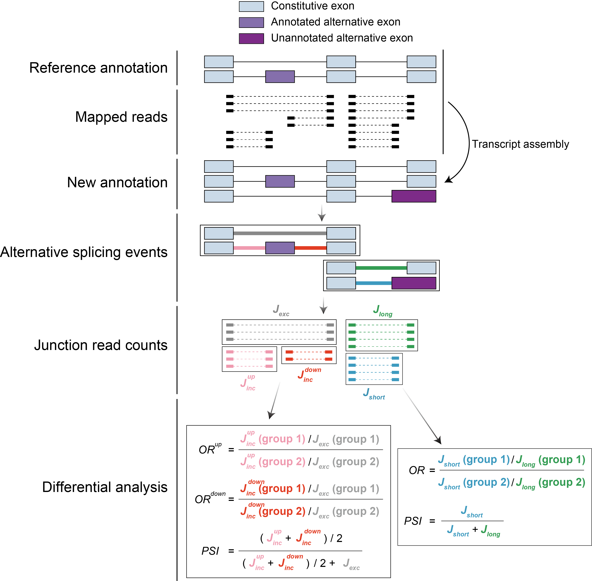

[](https://zenodo.org/doi/10.5281/zenodo.11214807)
[](https://github.com/NaotoKubota/Shiba/releases)


# Shiba

A unified computational method for robust identification of differential RNA splicing.


## Overview



## Installation

```bash
docker pull naotokubota/shiba
```

## Usage

***Shiba***

```bash
Shiba -i experiment.tsv -c config.txt
```

***SnakeShiba***, Snakemake-based workflow of Shiba

```bash
snakemake -s SnakeShiba --configfile config.yaml --cores 32 --use-singularity
```

***scShiba***, a single-cell RNA-seq version of Shiba

```bash
scShiba -i experiment.tsv -c config.txt
```

***SnakeScShiba***, Snakemake-based workflow of scShiba

```bash
snakemake -s SnakeScShiba --configfile config.yaml --cores 32 --use-singularity
```

See [the manual document](https://github.com/NaotoKubota/Shiba/blob/main/doc/MANUAL.md) for details.

## Citation

Kubota N, Chen L, Zheng S. (2024). [Shiba: A unified computational method for robust identification of differential RNA splicing across platforms](https://www.biorxiv.org/content/10.1101/2024.05.30.596331v1). *bioRxiv* 2024.05.30.596331
