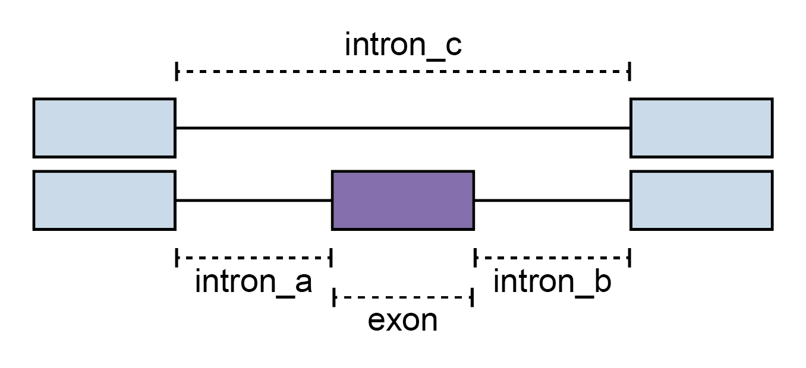

# MANUAL

This document provides a manual for Shiba and scShiba for users who want to analyze differential RNA splicing events from bulk and single-cell RNA-seq data.

## Shiba

### Before you start

- Please install [Docker](https://docs.docker.com/get-docker/) or [Singularity](https://sylabs.io/guides/3.7/user-guide/quick_start.html) on your system.
  - For running SnakeShiba or SnakeScShiba, you need to install [Snakemake](https://snakemake.readthedocs.io/en/stable/) and [Singularity](https://sylabs.io/guides/3.7/user-guide/quick_start.html), and clone the Shiba repository on your system (`git clone https://github.com/NaotoKubota/Shiba.git`).
- Please download a gene annotataion file of your interest in GTF format.
- Please perform mapping of RNA-seq reads to the reference genome and generate bam files by software such as [STAR](https://github.com/alexdobin/STAR) and [HISAT2](https://daehwankimlab.github.io/hisat2/).

<details>

<summary>Command to install a mouse gene annotation file (Ensembl 102):</summary>

```bash
wget https://ftp.ensembl.org/pub/release-102/gtf/mus_musculus/Mus_musculus.GRCm38.102.gtf.gz
gzip -d Mus_musculus.GRCm38.102.gtf.gz
```

</details>

### 1. Build an experiment table and a config file

`experiment.tsv`: A tab-separated text file of sample ID, path to bam files, and groups for differential analysis.

<details>

<summary>Example:</summary>

```bash
sample<tab>bam<tab>group
sample_1<tab>/path/to/workdir/bam/sample_1.bam<tab>Ref
sample_2<tab>/path/to/workdir/bam/sample_2.bam<tab>Ref
sample_3<tab>/path/to/workdir/bam/sample_3.bam<tab>Ref
sample_4<tab>/path/to/workdir/bam/sample_4.bam<tab>Alt
sample_5<tab>/path/to/workdir/bam/sample_5.bam<tab>Alt
sample_6<tab>/path/to/workdir/bam/sample_6.bam<tab>Alt
```

Please put bam files with their index files (`.bai`) in the `path/to/workdir/bam` directory and replace `<tab>` with a tab character.

</details>

<p></p>

`config.txt`: A text file of the configuration.

<details>

<summary>Example:</summary>

```bash
##############################
### Config file for Shiba ####
##############################

## General

# Number of processors to use
NUM_PROCESS=16
# Reference GTF file
GTF=/path/to/workdir/Mus_musculus.GRCm38.102.gtf
# Output directory
OUTPUT=/path/to/workdir/output
# Detect unannotated splicing events
UNANNOTATED=true

## Step3: bam2junc.sh

# Minimum anchor length for extracting exon-exon junction reads
MINIMUM_ANCHOR_LENGTH=6
# Minimum intron size for extracting exon-exon junction reads
MINIMUM_INTRON_SIZE=70
# Minimum intron size for extracting exon-exon junction reads
MAXIMUM_INTRON_SIZE=500000
# Strand specificity of RNA library preparation for extracting exon-exon junction reads
STRAND=XS

## Step4: psi.py

# Just calculate PSI for each sample, not perform statistical tests
ONLY_PSI=false
# Just calculate PSI for each group, not perform statistical tests
ONLY_PSI_GROUP=false
# FDR for DSE detection
FDR=0.05
# Miminum PSI change for DSE detection
DELTA_PSI=0.1
# Reference group for DSE detection
REFERENCE_GROUP=Ref
# Alternative group for DSE detection
ALTERNATIVE_GROUP=Alt
# Minumum value of total reads for each junction
MINIMUM_READS=10
# Print PSI for individual samples to output files
INDIVIDUAL_PSI=true
# Perform Welch's t-test between reference and Alternative group
TTEST=true

## Skip steps

SKIP_STEP1=false # bam2gtf.sh
SKIP_STEP2=false # gtf2event.py
SKIP_STEP3=false # bam2junc.sh
SKIP_STEP4=false # psi.py
SKIP_STEP5=false # expression.sh
SKIP_STEP6=false # pca.py
SKIP_STEP7=false # plots.py
```

You can skip some steps by setting `SKIP_STEP*` to `true`.

</details>

### 2. Run Shiba

```bash
# Docker
cp experiment.tsv config.txt /path/to/workdir
cd /path/to/workdir
docker run --rm -v $(pwd):$(pwd) naotokubota/shiba Shiba -i /path/to/workdir/experiment.tsv -c /path/to/workdir/config.txt
```

```bash
# Singularity
cp experiment.tsv config.txt /path/to/workdir
singularity exec docker://naotokubota/shiba Shiba -i /path/to/workdir/experiment.tsv -c /path/to/workdir/config.txt
```

> [!NOTE]
> When you use Singularity, you do not need to bind any paths as it automatically binds some paths in the host system to the container. In the default configuration, the system default bind points are `$HOME`, `/sys:/sys`, `/proc:/proc`, `/tmp:/tmp`, `/var/tmp:/var/tmp`, `/etc/resolv.conf:/etc/resolv.conf`, `/etc/passwd:/etc/passwd`, and `$PWD`. If files needed to be accessed are not in these paths, you can use the `--bind` option to bind the files to the container.

The output directory contains the following sub directories:

- `annotation`: Assembled GTF file.
- `events`: Text files of alternative splicing events.
- `junctions`: Junction read counts.
- `results`: Results of differential expression and splicing analysis.
- `plots`: Plots of alternative splicing events.

#### Files in `results/splicing`

- `PSI_[SE,FIVE,THREE,MXE,RI,MSE,AFE,ALE].txt`: Results of differential splicing analysis.
- `PSI_matrix_[sample,group].txt`: PSI values of each event for all samples or groups. Blank cells indicate that the event did not pass the minimum read count threshold.
- `summary.txt`: Numbers of the differentially spliced events for each splicing and event type.

<details>

<summary>Column description of PSI_[SE,FIVE,THREE,MXE,RI,MSE,AFE,ALE].txt</summary>

##### Common across all files

- **event_id**: ID of the event.
- **pos_id**: Positional ID of the event. This is useful for comparing the same event across different Shiba runs.
- **strand**: Strand of the event (*+* or *-*).
- **gene_id**: Gene ID.
- **gene_name**: Gene name.
- **label**: Label of the event type (*annotated* or *unannotated*).
- **ref_PSI**: PSI of the reference group.
- **alt_PSI**: PSI of the alternative group.
- **dPSI**: Delta PSI (Alt_PSI - Ref_PSI).
- **q**: *P*-value of Fisher's exact test adjusted by the Benjamini-Hochberg method.
- **Diff events**: Flag of if the event is differentially spliced between the reference and alternative groups (*Yes* or *No*).

##### For `PSI_SE.txt` (Skipped exon)



- **exon**: Genomic coordinates of the skipped exon.
- **intron_a**: Genomic coordinates of the left-side inclusive intron of the skipped exon.
- **intron_b**: Genomic coordinates of the right-side inclusive intron of the skipped exon.
- **intron_c**: Genomic coordinates of the exclusive intron of the skipped exon.
- **ref_junction_a**: Junction read counts of the left-side inclusive intron of the skipped exon in the reference group.
- **ref_junction_b**: Junction read counts of the right-side inclusive intron of the skipped exon in the reference group.
- **ref_junction_c**: Junction read counts of the exclusive intron of the skipped exon in the reference group.
- **alt_junction_a**: Junction read counts of the left-side inclusive intron of the skipped exon in the alternative group.
- **alt_junction_b**: Junction read counts of the right-side inclusive intron of the skipped exon in the alternative group.
- **alt_junction_c**: Junction read counts of the exclusive intron of the skipped exon in the alternative group.
- **OR_junction_a**: Odds ratio comparing junction read counts of the left-side inclusive intron to those of the exclusive intron, reference group against alternative group.
- **p_junction_a**: *P*-value of Fisher's exact test for the junction read counts of the left-side inclusive intron to those of the exclusive intron, reference group against alternative group.
- **OR_junction_b**: Odds ratio comparing junction read counts of the right-side inclusive intron to those of the exclusive intron, reference group against alternative group.
- **p_junction_b**: *P*-value of Fisher's exact test for the junction read counts of the right-side inclusive intron to those of the exclusive intron, reference group against alternative group.
- **p_maximum**: Greater of the two *P*-values of Fisher's exact tests.

##### For `PSI_FIVE.txt` (Alternative 5' splice site) and `PSI_THREE.txt` (Alternative 3' splice site)


- **exon_a**: Genomic coordinates of the longer exon using more internal splice site.
- **exon_b**: Genomic coordinates of the shorter exon using less internal splice site.
- **intron_a**: Genomic coordinates of the intron associated with the longer exon.
- **intron_b**: Genomic coordinates of the intron associated with the shorter exon.
- **ref_junction_a**: Junction read counts of the intron associated with the longer exon in the reference group.
- **ref_junction_b**: Junction read counts of the intron associated with the shorter exon in the reference group.
- **alt_junction_a**: Junction read counts of the intron associated with the longer exon in the alternative group.
- **alt_junction_b**: Junction read counts of the intron associated with the shorter exon in the alternative group.
- **OR**: Odds ratio comparing junction read counts of the intron associated with the longer exon to those of the intron associated with the shorter exon, reference group against alternative group.
- **p**: *P*-value of Fisher's exact test for the junction read counts of the intron associated with the longer exon to those of the intron associated with the shorter exon, reference group against alternative group.

##### For `PSI_MXE.txt` (Mutually exclusive exons)


- **exon_a**: Genomic coordinates of the left-side mutually exclusive exon.
- **exon_b**: Genomic coordinates of the right-side mutually exclusive exon.
- **intron_a1**: Genomic coordinates of the left-side inclusive intron of the left-side mutually exclusive exon.
- **intron_a2**: Genomic coordinates of the right-side inclusive intron of the left-side mutually exclusive exon.
- **intron_b1**: Genomic coordinates of the left-side inclusive intron of the right-side mutually exclusive exon.
- **intron_b2**: Genomic coordinates of the right-side inclusive intron of the right-side mutually exclusive exon.
- **ref_junction_a1**: Junction read counts of the left-side inclusive intron of the left-side mutually exclusive exon in the reference group.
- **ref_junction_a2**: Junction read counts of the right-side inclusive intron of the left-side mutually exclusive exon in the reference group.
- **ref_junction_b1**: Junction read counts of the left-side inclusive intron of the right-side mutually exclusive exon in the reference group.
- **ref_junction_b2**: Junction read counts of the right-side inclusive intron of the right-side mutually exclusive exon in the reference group.
- **alt_junction_a1**: Junction read counts of the left-side inclusive intron of the left-side mutually exclusive exon in the alternative group.
- **alt_junction_a2**: Junction read counts of the right-side inclusive intron of the left-side mutually exclusive exon in the alternative group.
- **alt_junction_b1**: Junction read counts of the left-side inclusive intron of the right-side mutually exclusive exon in the alternative group.
- **alt_junction_b2**: Junction read counts of the right-side inclusive intron of the right-side mutually exclusive exon in the alternative group.
- **OR_a1b1**: Odds ratio comparing junction read counts of the left-side inclusive intron of the left-side mutually exclusive exon to those of the left-side inclusive intron of the right-side mutually exclusive exon, reference group against alternative group.
- **p_a1b1**: *P*-value of Fisher's exact test for the junction read counts of the left-side inclusive intron of the left-side mutually exclusive exon to those of the left-side inclusive intron of the right-side mutually exclusive exon, reference group against alternative group.
- **OR_a1b2**: Odds ratio comparing junction read counts of the left-side inclusive intron of the left-side mutually exclusive exon to those of the right-side inclusive intron of the right-side mutually exclusive exon, reference group against alternative group.
- **p_a1b2**: Odds ratio comparing junction read counts of the left-side inclusive intron of the left-side mutually exclusive exon to those of the right-side inclusive intron of the right-side mutually exclusive exon, reference group against alternative group.
- **OR_a2b1**: Odds ratio comparing junction read counts of the right-side inclusive intron of the left-side mutually exclusive exon to those of the left-side inclusive intron of the right-side mutually exclusive exon, reference group against alternative group.
- **p_a2b1**: Odds ratio comparing junction read counts of the right-side inclusive intron of the left-side mutually exclusive exon to those of the left-side inclusive intron of the right-side mutually exclusive exon, reference group against alternative group.
- **OR_a2b2**: Odds ratio comparing junction read counts of the right-side inclusive intron of the left-side mutually exclusive exon to those of the right-side inclusive intron of the right-side mutually exclusive exon, reference group against alternative group.
- **p_a2b2**: Odds ratio comparing junction read counts of the right-side inclusive intron of the left-side mutually exclusive exon to those of the right-side inclusive intron of the right-side mutually exclusive exon, reference group against alternative group.
- **p_maximum**: Greater of the four *P*-values of Fisher's exact tests.

##### For `PSI_RI.txt` (Retained intron)


- **exon_a**: Genomic coordinates of the left-side exon.
- **exon_b**: Genomic coordinates of the right-side exon.
- **exon_c**: Genomic coordinates of the exon containing the retained intron.
- **intron_a**: Genomic coordinates of the retained intron.
- **ref_junction_a_start**: The left-side exon-intron junction read counts of the retained intron in the reference group.
- **ref_junction_a_end**: The right-side exon-intron junction read counts of the retained intron in the reference group.
- **alt_junction_a_start**: The left-side exon-intron junction read counts of the retained intron in the alternative group.
- **alt_junction_a_end**: The right-side exon-intron junction read counts of the retained intron in the alternative group.
- **OR_junction_a_start**: Odds ratio comparing the left-side exon-intron junction read counts to the intron junction read counts, reference group against alternative group.
- **p_junction_a_start**: *P*-value of Fisher's exact test for the left-side exon-intron junction read counts to the intron junction read counts, reference group against alternative group.
- **OR_junction_a_end**: Odds ratio comparing the right-side exon-intron junction read counts to the intron junction read counts, reference group against alternative group.
- **p_junction_a_end**: *P*-value of Fisher's exact test for the right-side exon-intron junction read counts to the intron junction read counts, reference group against alternative group.
- **p_maximum**: Greater of the two *P*-values of Fisher's exact tests.

##### For `PSI_MSE.txt` (Multiple skipped exons)


- **mse_n**: Number of skipped exons.
- **exon**: Genomic coordinates of the skipped exons, separated by semi-colons from the left to the right (e.g., `chr12:76067371-76067473;chr12:76068909-76068994`).
- **intron**: Genomic coordinates of the associated introns of the skipped exons, separated by semi-colons from the left to the right and the last one is the exclusive intron (e.g., `chr12:76060279-76067371;chr12:76068994-76074203;chr12:76060279-76074203`).
- **ref_junction**: Junction read counts of the associated introns of the skipped exons in the reference group, separated by semi-colons from the left to the right and the last one is the exclusive intron (e.g., `5899;4581;94`).
- **alt_junction**: Junction read counts of the associated introns of the skipped exons in the alternative group, separated by semi-colons from the left to the right and the last one is the exclusive intron (e.g., `3856;3243;610`).
- **OR_junction**: Odds ratio comparing junction read counts of the associated inclusive introns of the skipped exons to those of the exclusive intron, reference group against alternative group, separated by semi-colons from the left to the right (e.g., `9.927579014743532;9.166748676363493`).
- **p_juntion**: *P*-value of Fisher's exact test for the junction read counts of the associated inclusive introns of the skipped exons to those of the exclusive intron, reference group against alternative group, separated by semi-colons from the left to the right (e.g., `1.1031362512301498e-138;2.0130937584324167e-126`).

##### For `PSI_AFE.txt` (Alternative first exon) and `PSI_ALE.txt` (Alternative last exon)


- **exon_a**: Genomic coordinates of the distal exon.
- **exon_b**: Genomic coordinates of the proximal exon.
- **intron_a**: Genomic coordinates of the intron associated with the distal exon.
- **intron_b**: Genomic coordinates of the intron associated with the proximal exon.
- **ref_junction_a**: Junction read counts of the intron associated with the distal exon in the reference group.
- **ref_junction_b**: Junction read counts of the intron associated with the proximal exon in the reference group.
- **alt_junction_a**: Junction read counts of the intron associated with the distal exon in the alternative group.
- **alt_junction_b**: Junction read counts of the intron associated with the proximal exon in the alternative group.
- **OR**: Odds ratio comparing junction read counts of the intron associated with the distal exon to those of the intron associated with the proximal exon, reference group against alternative group.
- **p**: *P*-value of Fisher's exact test for the junction read counts of the intron associated with the distal exon to those of the intron associated with the proximal exon, reference group against alternative group.

##### when `ttest` is `true`

- \<sample\>_PSI: PSI of the sample. Blank cells indicate that the event did not pass the minimum read count threshold.
- p_ttest: *P*-value of Welch's t-test for the PSI of the reference and alternative groups. Please note that the *P*-value is not adjusted for multiple testing.

</details>

#### Files in `results/expression`

- `counts.txt`: Read counts for all samples.
- `TPM.txt`: TPM values for all samples.
- `CPM.txt`: CPM values for all samples.
- `DEG.txt`: Results of differential expression analysis by DESeq2.

#### Files in `results/pca`

- `tpm_pca.tsv`: Principal components for TPM matrix.
- `tpm_contribution.tsv`: Contribution to each principal component for TPM matrix.
- `psi_pca.tsv`: Principal components for PSI matrix.
- `psi_contribution.tsv`: Contribution to each principal component for PSI matrix.

<details>

<summary>An example of output directory structure:</summary>

```bash
output
├── annotation
│   └── assembled_annotation.gtf
├── events
│   ├── EVENT_AFE.txt
│   ├── EVENT_ALE.txt
│   ├── EVENT_FIVE.txt
│   ├── EVENT_MSE.txt
│   ├── EVENT_MXE.txt
│   ├── EVENT_RI.txt
│   ├── EVENT_SE.txt
│   └── EVENT_THREE.txt
├── junctions
│   ├── junctions.bed
│   └── logs
│       ├── featureCounts.log
│       └── regtools.log
├── plots
│   ├── data
│   │   ├── bar_AFE.html
│   │   ├── bar_ALE.html
│   │   ├── bar_FIVE.html
│   │   ├── bar_MSE.html
│   │   ├── bar_MXE.html
│   │   ├── bar_RI.html
│   │   ├── bar_SE.html
│   │   ├── bar_THREE.html
│   │   ├── pca_PSI.html
│   │   ├── pca_TPM.html
│   │   ├── scatter_AFE.html
│   │   ├── scatter_ALE.html
│   │   ├── scatter_FIVE.html
│   │   ├── scatter_MSE.html
│   │   ├── scatter_MXE.html
│   │   ├── scatter_RI.html
│   │   ├── scatter_SE.html
│   │   ├── scatter_THREE.html
│   │   ├── volcano_AFE.html
│   │   ├── volcano_ALE.html
│   │   ├── volcano_FIVE.html
│   │   ├── volcano_MSE.html
│   │   ├── volcano_MXE.html
│   │   ├── volcano_RI.html
│   │   ├── volcano_SE.html
│   │   └── volcano_THREE.html
│   └── summary.html
├── results
│   ├── expression
│   │   ├── counts.txt
│   │   ├── CPM.txt
│   │   ├── DEG.txt
│   │   ├── logs
│   │   │   ├── DESeq2.log
│   │   │   └── featureCounts.log
│   │   ├── TPM_CPM.xlsx
│   │   └── TPM.txt
│   ├── pca
│   │   ├── psi_contribution.tsv
│   │   ├── psi_pca.tsv
│   │   ├── tpm_contribution.tsv
│   │   └── tpm_pca.tsv
│   └── splicing
│       ├── PSI_AFE.txt
│       ├── PSI_ALE.txt
│       ├── PSI_FIVE.txt
│       ├── PSI_matrix_group.txt
│       ├── PSI_matrix_sample.txt
│       ├── PSI_MSE.txt
│       ├── PSI_MXE.txt
│       ├── PSI_RI.txt
│       ├── PSI_SE.txt
│       ├── PSI_THREE.txt
│       └── summary.txt
└── Shiba.log
```

</details>

<details>

<summary>Details of each step:</summary>

#### Step1: `bam2gtf.sh`

Perform transcript assembly based on mapped reads.

```bash
Usage: bam2gtf.sh -i experiment.tsv -r reference_annotation.gtf -o assembled_annotation.gtf -p [VALUE]

    -h  Display help
    -i  Experiment table
    -r  Reference GTF file
    -o  Assembled GTF file
    -p  Number of processors to use (default: 1)
```

#### Step2: `gtf2event.py`

Make a file of alternative splicing events.

```bash
usage: gtf2event.py [-h] -i GTF [-r REFERENCE_GTF] -o OUTPUT [-p NUM_PROCESS]

Extract alternative splicing events from GTF file

optional arguments:
  -h, --help            show this help message and exit
  -i GTF, --gtf GTF     Input GTF file
  -r REFERENCE_GTF, --reference-gtf REFERENCE_GTF
                        Reference GTF file
  -o OUTPUT, --output OUTPUT
                        Output directory
  -p NUM_PROCESS, --num-process NUM_PROCESS
                        Number of processors to use
```

Example of `event_SE.txt`:

```bash
event_id  pos_id  exon  intron_a  intron_b  intron_c  strand  gene_id  gene_name  label
SE_1  GL456354.1@84521-85111@83560-85765  GL456354.1:84521-85111  GL456354.1:83560-84521  GL456354.1:85111-85765  GL456354.1:83560-85765  -  ENSMUSG00000094337  Gm3286  annotated
SE_2  chr10@100080857-100080940@100080130-100087347  chr10:100080857-100080940  chr10:100080130-100080857  chr10:100080940-100087347  chr10:100080130-100087347  +  ENSMUSG00000019966  Kitl  annotated
SE_3  chr10@100485051-100485125@100478022-100487162  chr10:100485051-100485125  chr10:100478022-100485051  chr10:100485125-100487162  chr10:100478022-100487162  -  ENSMUSG00000036676  Tmtc3  annotated
SE_4  chr10@100485051-100485185@100478022-100487162  chr10:100485051-100485185  chr10:100478022-100485051  chr10:100485185-100487162  chr10:100478022-100487162  -  ENSMUSG00000036676  Tmtc3  annotated
SE_5  chr10@100495641-100495661@100494954-100495823  chr10:100495641-100495661  chr10:100494954-100495641  chr10:100495661-100495823  chr10:100494954-100495823  +  ENSMUSG00000019971  Cep290  annotated
SE_6  chr10@100578315-100578431@100577358-100583914  chr10:100578315-100578431  chr10:100577358-100578315  chr10:100578431-100583914  chr10:100577358-100583914  -  ENSMUSG00000046567  4930430F08Rik  annotated
SE_7  chr10@100582263-100582322@100578431-100583914  chr10:100582263-100582322  chr10:100578431-100582263  chr10:100582322-100583914  chr10:100578431-100583914  -  ENSMUSG00000046567  4930430F08Rik  annotated
SE_8  chr10@100594537-100594656@100592429-100595035  chr10:100594537-100594656  chr10:100592429-100594537  chr10:100594656-100595035  chr10:100592429-100595035  +  ENSMUSG00000056912  1700017N19Rik  annotated
SE_9  chr10@100610596-100610715@100609254-100612429  chr10:100610596-100610715  chr10:100609254-100610596  chr10:100610715-100612429  chr10:100609254-100612429  +  ENSMUSG00000056912  1700017N19Rik  annotated
...
```

#### Step3: `bam2junc.sh`

Make a table of junction read counts.

```bash
Usage: bam2junc.sh -i experiment.tsv -r RI_EVENT.txt -o junctions.bed -p [VALUE] -a [VALUE] -m [VALUE] -M [VALUE] -s [VALUE]

    -h  Display help
    -i  Experiment table
    -r  Intron retention event
    -o  Junction read counts
    -p  Number of processors to use (default: 1)
    -a  Minimum anchor length (default: 8)
    -m  Minimum intron size (default: 70)
    -M  Maximum intron size (default: 500000)
    -s  Strand specificity of RNA library preparation; XS: unstranded, RF: first-strand, FR: second-strand (default: XS)
```

#### Step4: `psi.py`

Calculate PSI and detect differential events.

```bash
usage: psi.py [-h] [-p NUM_PROCESS] [-g GROUP] [-f FDR] [-d PSI] [-r REFERENCE] [-a ALTERNATIVE] [-m MINIMUM_READS] [-i] [-t] [--onlypsi] [--onlypsi-group] [--excel]
              junctions event output

PSI calculation for alternative splicing events

positional arguments:
  junctions             A bed file of Junction read counts generated by bam2junc.sh
  event                 Directory that contains text files of alternative splicing events generated by gtf2event.py
  output                Directory for output files

options:
  -h, --help            show this help message and exit
  -p NUM_PROCESS, --num-process NUM_PROCESS
                        Number of processors to use (default: 1)
  -g GROUP, --group GROUP
                        Group information for detecting differential events (default: None)
  -f FDR, --fdr FDR     FDR for detecting differential events (default: 0.05)
  -d PSI, --psi PSI     Threshold of delta PSI for detecting differential events (default: 0.1)
  -r REFERENCE, --reference REFERENCE
                        Reference group for detecting differential events (default: None)
  -a ALTERNATIVE, --alternative ALTERNATIVE
                        Alternative group for detecting differential events (default: None)
  -m MINIMUM_READS, --minimum-reads MINIMUM_READS
                        Minumum value of total reads for each junction for detecting differential events (default: 10)
  -i, --individual-psi  Print PSI for individual samples to output files (default: False)
  -t, --ttest           Perform Welch's t-test between reference and alternative group (default: False)
  --onlypsi             Just calculate PSI for each sample, not perform statistical tests (default: False)
  --onlypsi-group       Just calculate PSI for each group, not perform statistical tests (Overrides --onlypsi when used together) (default: False)
  --excel               Make result files in excel format (default: False)
```

#### Step5: `expression.sh`

Gene expression analysis.

```bash
Usage: expression.sh -i experiment.txt -g reference_annotation.gtf -o output_dir -r [VALUE] -a [VALUE] -p [VALUE]

    -h  Display help
    -i  Experiment table
    -g  Reference GTF file
    -o  Output directory
    -r  Reference group for differential expression analysis (default: NA)
    -a  Alternative group for differential expression analysis (default: NA)
    -p  Number of processors to use (default: 1)
```

#### Step6: `pca.py`

Principal component analysis.

```bash
usage: pca.py [-h] [--input-tpm INPUT_TPM] [--input-psi INPUT_PSI] [-g GENES] [-o OUTPUT]

pca.py: Principal Component Analysis for matrix of gene expression and splicing

options:
  -h, --help            show this help message and exit
  --input-tpm INPUT_TPM
                        Input TPM file (default: None)
  --input-psi INPUT_PSI
                        Input PSI file (default: None)
  -g GENES, --genes GENES
                        Number of highly-variable genes or splicing events to calculate PCs (default: 3000)
  -o OUTPUT, --output OUTPUT
                        Output directory (default: None)
```

#### Step7: `plots.py`

Make plots.

```bash
usage: plots.py [-h] [-i INPUT] [-e EXPERIMENT_TABLE] [-o OUTPUT]

Make plots for alternative splicing events

options:
  -h, --help            show this help message and exit
  -i INPUT, --input INPUT
                        Directory that contains result files (default: None)
  -e EXPERIMENT_TABLE, --experiment-table EXPERIMENT_TABLE
                        Experiment table file (default: None)
  -o OUTPUT, --output OUTPUT
                        Directory for output files (default: None)
```

</details>

## SnakeShiba

A Snakemake-based workflow of Shiba. This is useful for running Shiba on a cluster. Snakemake automatically parallelizes the jobs and manages the dependencies between them.

### 1. Build an experiment table and a config file

`experiment.tsv`: A tab-separated text file of sample ID, path to fastq files, and groups for differential analysis. This is the same as the input for Shiba.

<p></p>

`config.yaml`: A yaml file of the configuration.

<details>

<summary>Example:</summary>

```yaml
workdir:
  /path/to/workdir
container:
  docker://naotokubota/shiba
gtf:
  /path/to/Mus_musculus.GRCm38.102.gtf
experiment_table:
  /path/to/experiment.tsv
cpu:
  16
unannotated:
  True

# Junction read filtering
minimum_anchor_length:
  6
minimum_intron_length:
  70
maximum_intron_length:
  500000
strand:
  XS

# PSI calculation
only_psi:
  False
fdr:
  0.05
delta_psi:
  0.1
reference_group:
  Ref
alternative_group:
  Alt
minimum_reads:
  10
individual_psi:
  True
ttest:
  True
excel:
  False
```

You can generate a file of splicing analysis results in excel format by setting `excel` to `True`.

</details>

### 2. Run SnakeShiba

Please make sure that you have installed Snakemake and Singularity and cloned the Shiba repository on your system.

```bash
snakemake -s /path/to/Shiba/SnakeShiba --configfile config.yaml --cores 16 --use-singularity --rerun-incomplete
```

The output directory structure is the same as the output of Shiba but the following sub directories are added:

- `benchmark`: [Benchmarking](https://snakemake.readthedocs.io/en/stable/tutorial/additional_features.html) results.
- `log`: Log files of each step.

## scShiba

### 1. Build an experiment table and a config file

`experiment.tsv`: A tab-separated text file of barcode file and STAR solo raw output directory.

<details>

<summary>Example:</summary>

```bash
barcode<tab>SJ
/path/to/barcodes_run1.tsv<tab>/path/to/run1/Solo.out/SJ/raw
/path/to/barcodes_run2.tsv<tab>/path/to/run2/Solo.out/SJ/raw
/path/to/barcodes_run3.tsv<tab>/path/to/run3/Solo.out/SJ/raw
/path/to/barcodes_run4.tsv<tab>/path/to/run4/Solo.out/SJ/raw
```

`barcodes.tsv` is a tab-separated text file of barcode and group name like this:

```bash
barcode<tab>group
TTTGTTGTCCACACCT<tab>Cluster-1
TCAAGACCACTACAGT<tab>Cluster-1
TATTTCGGTACAGTAA<tab>Cluster-1
ATCCTATGTTAATCGC<tab>Cluster-1
ATCGATGAGTTTCTTC<tab>Cluster-2
ATCGATGGTCTTGCTC<tab>Cluster-2
TATGTTCGTCAGGCAA<tab>Cluster-2
ATCGCCTAGACTCGAG<tab>Cluster-2
...
```

Please replace `<tab>` with a tab character.

</details>

<p></p>

`config.txt`: A text file of the configuration.

<details>

<summary>Example:</summary>

```bash
###############################
### Config file for scShiba ###
###############################

## General

# Number of processors to use
NUM_PROCESS=16
# Reference GTF file
GTF=/path/to/workdir/Mus_musculus.GRCm38.102.gtf
# Output directory
OUTPUT=./output

## Step3: scpsi.py

# Just calculate PSI for each sample, not perform statistical tests
ONLY_PSI=false
# FDR for DSE detection
FDR=0.05
# Miminum PSI change for DSE detection
DELTA_PSI=0.1
# Reference group for DSE detection
REFERENCE_GROUP=Ref
# Alternative group for DSE detection
ALTERNATIVE_GROUP=Alt
# Minumum value of total reads for each junction
MINIMUM_READS=10

## skip steps

SKIP_STEP1=false # gtf2event.py
SKIP_STEP2=false # sc2junc.py
SKIP_STEP3=false # scpsi.py
```

You can skip some steps by setting `SKIP_STEP1`, `SKIP_STEP2`, and `SKIP_STEP3` to `true`.

</details>

### 2. Run scShiba

```bash
# Docker
cp experiment.tsv config.txt /path/to/workdir
cd /path/to/workdir
docker run --rm -v $(pwd):$(pwd) naotokubota/shiba scShiba -i /path/to/workdir/experiment.tsv -c /path/to/workdir/config.txt
```

```bash
# Singularity
cp experiment.tsv config.txt /path/to/workdir
singularity exec docker://naotokubota/shiba scShiba -i /path/to/workdir/experiment.tsv -c /path/to/workdir/config.txt
```

The output directory contains the following sub directories:

- `events`: Text files of alternative splicing events. Note that the events are limited to annotated ones.
- `junctions`: Junction read counts.
- `results`: Results of differential splicing analysis.

## SnakeScShiba

A Snakemake-based workflow of scShiba.

### 1. Build an experiment table and a config file

`experiment.tsv`: A tab-separated text file of sample ID, path to fastq files, and groups for differential analysis. This is the same as the input for scShiba.

`config.yaml`: A yaml file of the configuration.

<details>

<summary>Example:</summary>

```yaml
workdir:
  /path/to/workdir
container:
  docker://naotokubota/shiba
gtf:
  /path/to/Mus_musculus.GRCm38.102.gtf
experiment_table:
  /path/to/experiment.tsv
cpu:
  16

# PSI calculation
only_psi:
  False
fdr:
  0.05
delta_psi:
  0.1
reference_group:
  Ref
alternative_group:
  Alt
minimum_reads:
  10
excel:
  False
```

You can generate a file of splicing analysis results in excel format by setting `excel` to `True`.

</details>

### 2. Run SnakeScShiba

Please make sure that you have installed Snakemake and Singularity and cloned the Shiba repository on your system.

```bash
snakemake -s /path/to/Shiba/SnakeScShiba --configfile config.yaml --cores 16 --use-singularity --rerun-incomplete
```

The output directory structure is the same as the output of scShiba but the following sub directories are added:

- `benchmark`: [Benchmarking](https://snakemake.readthedocs.io/en/stable/tutorial/additional_features.html) results.
- `log`: Log files of each step.
